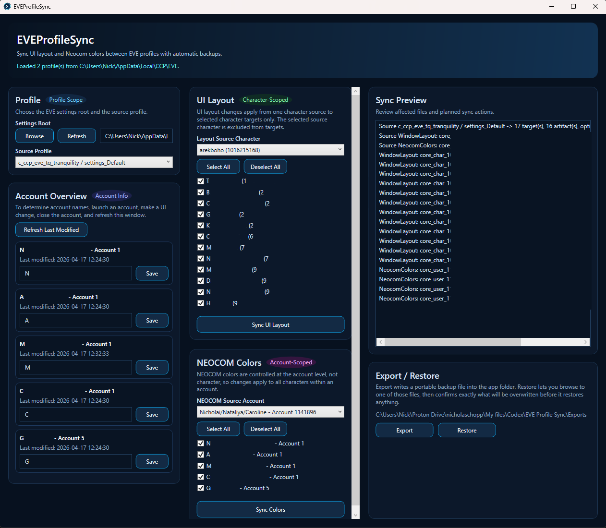

# EVEProfileSync

EVEProfileSync is a lightweight Windows desktop app for syncing EVE Online UI layout and NEOCOM color settings between local profiles, characters, and account-scoped settings files.

## Install

1. Download the latest installer: [EVEProfileSync-Setup.exe](https://github.com/PapaChop83/EVEProfileSync/releases/latest/download/EVEProfileSync-Setup.exe)
2. Run the installer and follow the setup prompts.
3. Launch `EVEProfileSync` from the Start Menu or desktop shortcut.



## What it does

- Auto-discovers EVE settings from `%LOCALAPPDATA%\CCP\EVE` or a manually selected folder
- Shows local `settings_*` profiles for each detected server installation
- Resolves character IDs to character names when public ESI lookups are available
- Lets you label local account IDs and inspect the last modified timestamp for each account-scoped file
- Exports a portable backup archive to the app folder
- Restores from a selected backup archive after showing which files will be overwritten

## Sync model

- `UI Layout`
  Copies validated `core_char_*.dat` content from one source character to checked target characters in the selected profile.
- `NEOCOM Colors`
  Copies validated `core_user_*.dat` content from one source account to checked target accounts in the selected profile.
- `Export / Restore`
  Creates or restores a portable `.eveprofilesyncbackup` archive for the current source profile.

## Using the app

1. Open the app and confirm the settings root points to `%LOCALAPPDATA%\CCP\EVE` or one of its server folders.
2. Choose the source `settings_*` profile.
3. In `Account Overview`, optionally label local account IDs and use `Refresh Last Modified` after making an in-game account-scoped UI change.
4. In `UI Layout`, choose a source character and the target characters to receive that layout.
5. In `NEOCOM Colors`, choose a source account and the target accounts to receive those colors.
6. Use `Export` to create a portable backup archive before making broader changes, or `Restore` to browse to a backup file and preview overwrites.

## Build requirements

- Windows
- .NET 8 SDK

## Local development

```powershell
dotnet restore EVEProfileSync.sln
dotnet build EVEProfileSync.sln
dotnet test EVEProfileSync.sln
dotnet run --project .\src\EVEProfileSync.App\EVEProfileSync.App.csproj
```

## Build a portable publish locally

```powershell
dotnet publish .\src\EVEProfileSync.App\EVEProfileSync.App.csproj `
  -c Release `
  -r win-x64 `
  --self-contained false `
  -o .\artifacts\publish\win-x64
```

The publish output is a portable Windows folder that can be zipped and attached to a GitHub release.

## Build the Inno Setup installer locally

1. Publish the app:

```powershell
dotnet publish .\src\EVEProfileSync.App\EVEProfileSync.App.csproj `
  -c Release `
  -r win-x64 `
  --self-contained false `
  -o .\artifacts\publish\win-x64
```

2. Compile the installer with Inno Setup 6:

```powershell
iscc .\installer\EVEProfileSync.iss /DMyAppVersion=1.0.0
```

That produces an installer like `artifacts\installer\EVEProfileSync-Setup-1.0.0.exe`.

## Public release workflow

This repo includes a GitHub Actions workflow that:

- restores, builds, and tests on pushes and pull requests
- publishes a portable `win-x64` build on version tags like `v1.0.0`
- builds an Inno Setup installer from that publish output
- uploads both the portable zip and the installer as workflow artifacts and GitHub release assets

See [docs/RELEASING.md](docs/RELEASING.md) for the release checklist and tagging flow.

## Project layout

- `src/EVEProfileSync.Core`
  Core discovery, artifact mapping, backup export/restore, sync execution, and process-guard logic
- `src/EVEProfileSync.App`
  WPF desktop UI, app icon, account labels, and character-name resolution
- `tests/EVEProfileSync.Tests`
  Fixture-driven tests for discovery, sync planning, backup/export restore, and snapshot comparison
- `docs/images`
  Public documentation screenshots and other sanitized assets

## Notes

- This is a Windows-only app.
- Character names can be resolved from public ESI, but account IDs remain local-only and should be labeled manually.
